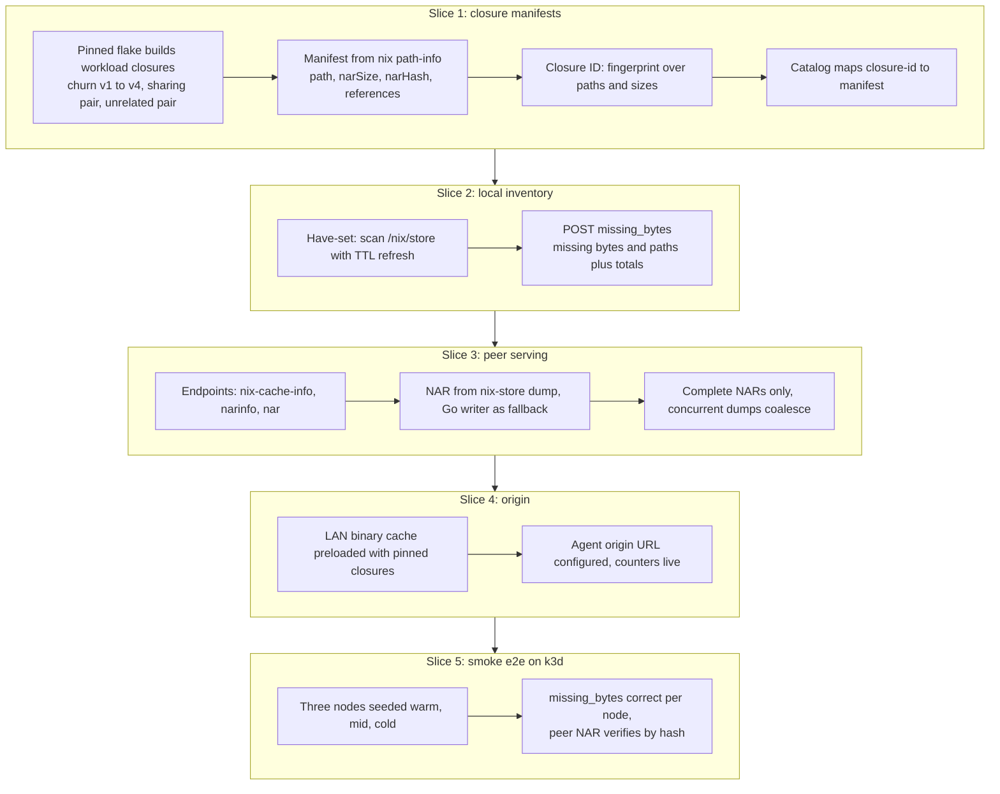
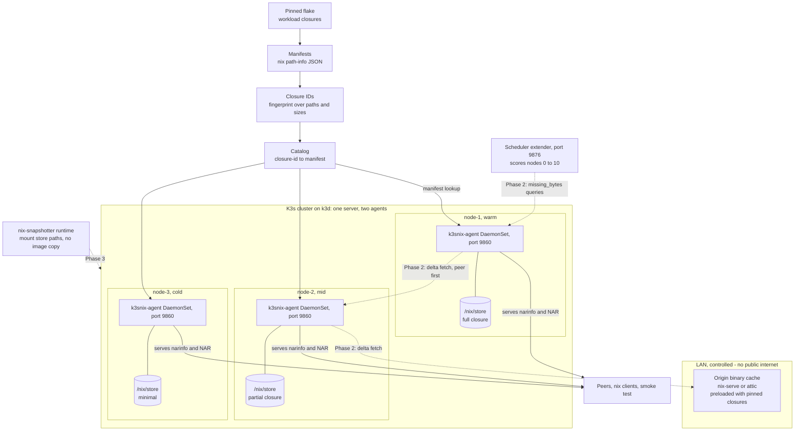

# Phase 1 Plan — Closure Analysis and Cache Inventory

Phase 1 covers the first two boxes of the architecture deck: (1) Nix closure
analysis with content-addressed paths and a pinned manifest, and (2) initializing
the cache inventory across the local, peer, and origin tiers. It delivers the
data plane only. Scheduling and the delta fetch arrive in Phase 2, the runtime
and the benchmark in Phase 3.

The operating rule for this phase: **serve and count, never fetch on a pod
start.**

## Goal

Any closure built from the pinned flake can be described by a manifest and a
content-derived ID, and every node in the cluster can answer two questions
through the agent: what am I missing from this closure, and here is the NAR for
a path I hold. The origin tier exists, is preloaded, and is counted, even though
nothing pulls from it until Phase 2.

## Scope

In scope:

- Pinned flake building the workload closures and emitting manifests
- Content-derived closure IDs and the catalog that maps them to manifests
- Node agent inventory (have-set) and the missing-bytes API
- Node agent serving the Nix binary-cache protocol for peers
- A controlled LAN origin binary cache, preloaded and instrumented
- A smoke e2e on a three-node k3d cluster

Out of scope (guard rails against creep):

- Scheduler extender, scoring, any kube-scheduler integration (Phase 2)
- Fetching missing NARs from peers or origin (Phase 2 delta fetch)
- nix-snapshotter, pod rootfs, lazy mounts (Phase 3)
- Benchmark numbers, crossover sweeps, traffic shaping (Phase 3 and the
  harness phases of spec.md)

## Acceptance criteria

- [ ] `nix flake lock` pins nixpkgs and every workload input; versions are recorded
- [ ] Each closure emits a manifest from `nix path-info --json`: path, narSize,
      narHash, references
- [ ] Closure IDs are fingerprints over the path list plus sizes, never taken
      from a pod annotation
- [ ] The catalog maps closure-id to manifest, and Go code parses both nix
      native JSON and the project format
- [ ] The three workload families exist with measured deltas: the churn ladder
      v1 to v4 (1 to 5 percent byte steps, verified with `nix path-info -rS`),
      a glibc-sharing pair, and an unrelated pair as the negative control
- [ ] The agent answers `POST /v1/missing_bytes(closure)` from its own
      `/nix/store` with missing bytes and paths plus totals; the have-set is
      TTL-refreshed and never leaves the node toward the API server
- [ ] The agent serves `/nix-cache-info`, `*.narinfo`, and `nar/*.nar`; every
      served NAR hash-matches its narinfo; a partial NAR is never visible;
      concurrent same-path dumps coalesce
- [ ] The LAN origin cache is running, preloaded with the pinned closures, and
      the agent's origin request and byte counters increment (no dead flags)
- [ ] Smoke e2e passes: three k3d nodes seeded warm, mid, and cold; each node's
      missing-bytes answer is correct for its state, and a NAR fetched from a
      peer verifies byte-identical by hash
- [ ] `nix flake check` stays green throughout

## Build order

Each slice lands with its tests before the next begins.

1. **Closure manifests.** Extend the flake to build the workload closures and
   dump path-info JSON; implement the Go parser, the fingerprint, and the
   catalog. Done when a real `nix path-info` dump round-trips through the
   parser and the ID is stable across rebuilds of the same closure.
2. **Local inventory.** Store scanning with TTL refresh and the missing-bytes
   computation. Done when unit tests cover hit, partial, and cold nodes, and
   the alias-tolerant basename matching behaves.
3. **Peer serving.** narinfo and NAR endpoints, dumping through
   `nix-store --dump` with the pure-Go NAR writer as fallback. Done when a
   dump, serve, and re-hash round-trip test passes and concurrent requests
   produce one dump.
4. **Origin.** Stand up a controlled binary cache (nix-serve or attic) on the
   LAN, preload it with the pinned closures, wire the agent's origin URL and
   counters. Done when the origin answers narinfo requests in the smoke
   environment and its counters move.
5. **Smoke e2e.** Three-node k3d, seeded stores, catalog as a ConfigMap,
   agents as a DaemonSet. Done when the acceptance checklist above passes end
   to end.

## Verification

- Unit: manifest parsing, fingerprint stability, missing-bytes computation,
  NAR writer and hash round-trip, nix base32 vectors
- Integration: agent with catalog and seeded store answering missing_bytes;
  narinfo and NAR served and verified
- E2E: the k3d smoke described above
- Everything runs under `nix flake check`

## Repo touchpoints

| Path | Purpose |
|---|---|
| `nix/closures.nix` | builds pinned closures, emits manifests |
| `internal/closure` | parse, fingerprint, diff |
| `internal/inventory` | have-set and missing computation |
| `internal/agent` | HTTP API and NAR serving |
| `cmd/agent` | binary entry point |
| `deploy/` | DaemonSet, catalog ConfigMap, origin cache |
| `hack/` | smoke e2e scripts |
| `docs/` | this plan |

## Phase 1 build flow

## System at the end of Phase 1

Solid edges are live in Phase 1. Dashed edges are later phases, drawn to show
where the system is heading: the scheduler extender and the delta fetch arrive
in Phase 2, the nix-snapshotter runtime in Phase 3. kubelet and containerd are
untouched throughout.

## References

- Evaluation protocol, baselines, metrics, and correctness gates: `spec.md`
  sections 5 through 7 in the BTech report repository
- Reference implementation for slices 1 through 3: the Phase 0/2/3 cut in the
  report repository (parse, inventory, and NAR serving), rewritten fresh here
- Deck: architecture slide, Phase 1 boxes 1 and 2
